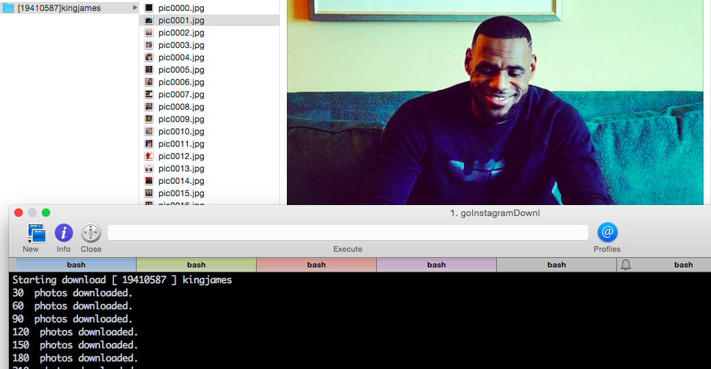

goInstagram
======================
     

A Instagram photo tool that supports concurrency download. This tool help you to download those photos for your backup, all the photos still own by original creator.

Install
--------------

    go get -u -x github.com/kkdai/goInstagramDownloader

Note, you need go to [Instagram developer page](https://instagram.com/developer/clients/manage/) to get latest token and update in environment variables

     export InstagramID="YOUR_ClientID_HERE"

Usage
---------------------

    goInstagramDownloader [options] 

All the photos will download to `USERS/Pictures/goInstagram`.

Options
---------------

- `-n` Instagram page name such as: [kingjames](https://instagram.com/kingjames/) 
- `-c` number of workers. (concurrency), default workers is "2"

Examples
---------------

Download all photos from LeBron James Instagram Photos with 10 workers.

  goInstagramDownloader -n=kingjames -c=10

Snapshot
---------------

TODOs
---------------

- Support video download.

Inspired
---------------

- Instagram API by Go [https://github.com/gedex/go-instagram](https://github.com/gedex/go-instagram).
- Instagram Photo download by Python: [https://github.com/dangoldin/instagram-download](https://github.com/dangoldin/instagram-download)

Contribute
---------------

Please open up an issue on GitHub before you put a lot efforts on pull request.
The code submitting to PR must be filtered with `gofmt`

Related Project
---------------

Here also a Facebook Photo downloader written by Go. [https://github.com/kkdai/goFBPages](https://github.com/kkdai/goFBPages)

Advertising
---------------

If you want to browse facebook page on your iPhone, why not check my App here :p [粉絲相簿](https://itunes.apple.com/tw/app/fen-si-xiang-bu/id839324997?l=zh&mt=8)

Project52
---------------

It is one of my [project 52](https://github.com/kkdai/project52).

License
---------------

This package is licensed under MIT license. See LICENSE for details.

